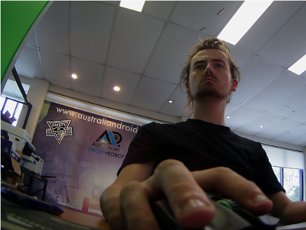
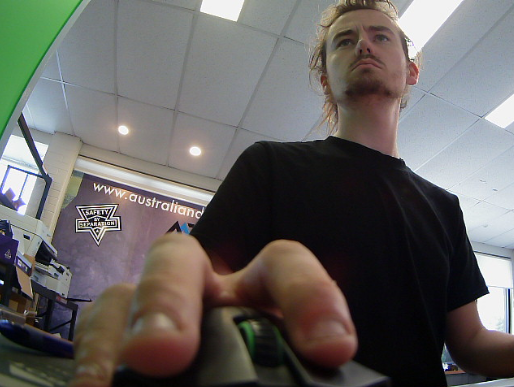
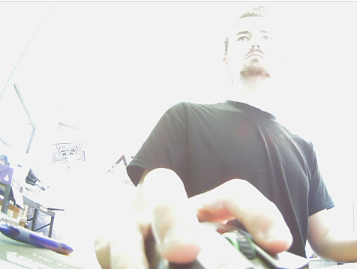

# Exposure Controller

## Usage

Once compiled, usage takes the following form:

```
./exposure_controller -d /dev/video0 -e 100
```

Where `-d` specifies the video device and `-e` specifies the desired exposure value.

To quote the docs:

> The exposure time is limited by the frame interval. Drivers should interpret the values as 100 µs units, where the value 1 stands for 1/10000th of a second, 10000 for 1 second and 100000 for 10 seconds.

The `-e` flag therefore refers to exposure time in units of 100 microseconds. For the test camera, I found a value of 100 (10 milliseconds) to be a good starting point.

| Exposure Time | Resulting Image                         |
| ------------- | --------------------------------------- |
| 5ms (50)      |    |
| 10ms (100)    |   |
| 100ms (1000)  |  |

## Compilation

Nothing special.
Just run:

```
gcc exposure_controller.c -o exposure_controller
```

## Prerequisites

Everything was included from default on a Pi 4 running Raspberry Pi OS 64-bit.

The system requires V4L2 headers, which are included in the `libv4l-dev` package on Debian-based systems. (This is standard on Linux machines with video support however.)
The experiment also requires a camera.

## References and Links

[Kernel Docs](https://docs.kernel.org/userspace-api/media/v4l/ext-ctrls-camera.html) was pretty helpful and had a decent reference for the exact control IDs.
